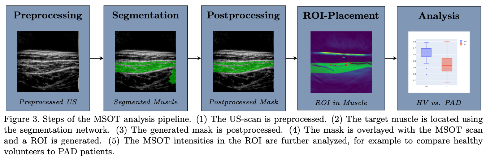
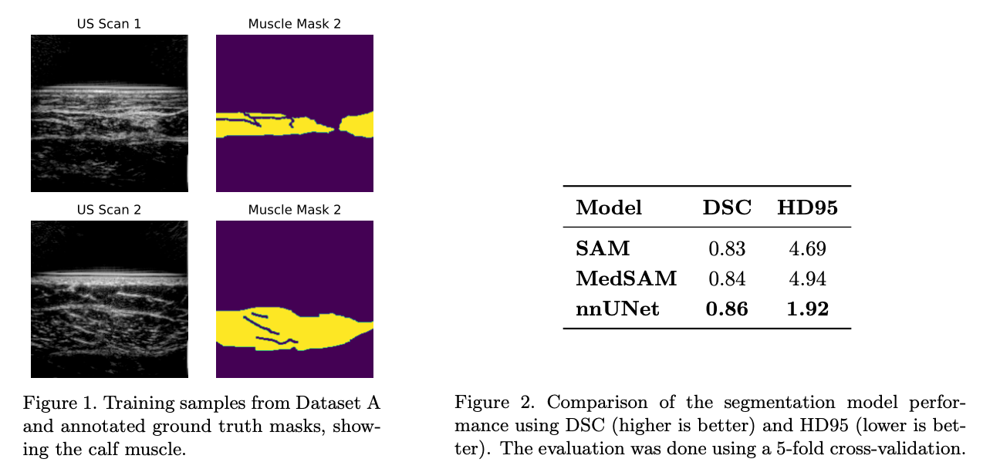
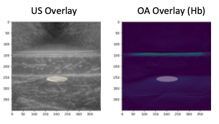
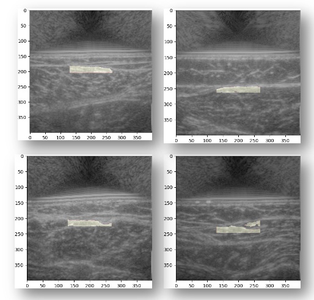
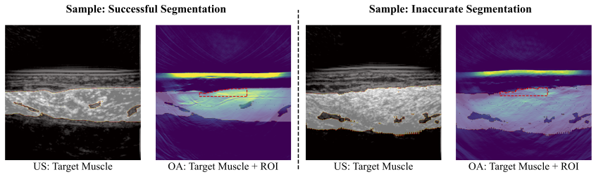
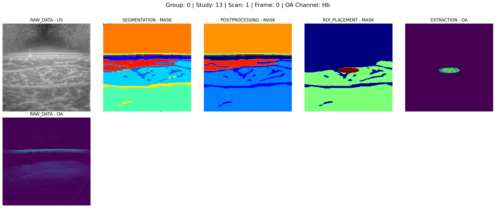

# Ultrasound Segmentation / MSOT Analysis Pipeline

This README is a high-level description. For detailed explanations, instructions or trained models, contact the author: moritz.schillinger@fau.de.

The repository is an updated and extended version of the code used in a prior study. The abstract below summarizes that previous version.

**Abstract:**

**Automatic Muscle Segmentation for the Diagnosis of Peripheral Artery Disease Using Multispectral Optoacoustic Tomography**

*Multispectral optoacoustic tomography (MSOT) is an imaging modality that visualizes chromophore concentrations, such as oxygenated and deoxygenated hemoglobin, aiding in the diagnosis of blood-perfusion-related
diseases like peripheral artery disease (PAD). Previous MSOT-based diagnostic studies involved experts manually
selecting a region of interest (ROI) with a predefined shape in the target muscle to analyze blood oxygenation.
This study automates this process using a deep-learning-based segmentation model applied to co-registered
ultrasound images.*

*Our pipeline automatically generates an ROI and places it in the MSOT image by segmenting the target
muscle in the ultrasound image. We evaluated its performance using two PAD-related datasets. Our automati-
cally generated ROIs achieved areas under the ROC curve (AUCs) of 0.87 and 0.76 at classifying PAD patients,
comparable to manually drawn ROIs by clinical experts. This approach could reduce annotation effort in future
MSOT studies while providing ROIs with greater physiological relevance.*

[https://doi.org/10.1117/12.3049067](https://doi.org/10.1117/12.3049067)

## Overview

Configurable pipeline for automatic ultrasound muscle segmentation and MSOT ROI analysis. It:
- loads OA + US data from various source formats,
- preprocesses OA and US frames,
- segments muscle using a pluggable backend (default: custom U-Net, tested using PyTorch 2.3.1),
- postprocesses masks,
- places ROIs of various shapes in US and maps them to OA,
- extracts ROI intensities and supports modular downstream tasks.

A demo configuration can be found in the [`pipeline.py`](v2/pipeline.py). 

## Pipeline Modules

- Preprocessing
  - Loads frames/scans, resizing and normalization, optional batching; writes standardized US images.
- Segmentation
  - Loads the selected backend, applies model-specific preprocessing, predicts masks (frame or batch), exports raw masks.
- Postprocessing
  - Connected components, keep largest, smoothing/cleanup, exports cleaned masks.
- ROI Placement
  - Builds ROI(s) in segmented muscle; supports ellipse, static ROIs and polygon; sensitivity-aware clipping; exports JSON/masks and optional iThera iLabs ellipse annotations.
- Extraction
  - Extracts various statistical metrics from a ROI on the MSOT image.
- Analysis
  - Runs various downstream analysis tasks (disease classification, image quality metrics, depth profiles).
- Additional Modules
  - iAnnotation Loader: Loads ithera annotation format.
  - Dataset Loader: Loads arbitrary dataset.
  - Summary Plot: Creates per sample visualization of all pipeline steps.

  
## Visualizations

### Segmentation Results (v1)

### Sample ROIs based on Ultrasound (v1)

<table>
  <tr>
    <td align="center">
      
<strong>Ellipse</strong>

      
    </td>
    <td align="center">
      
<strong>Complex</strong>

      
    </td>
  </tr>
</table>

### ROIs and Optoacoustic (v1)

### Summary Plot of Demo Image (v2)

